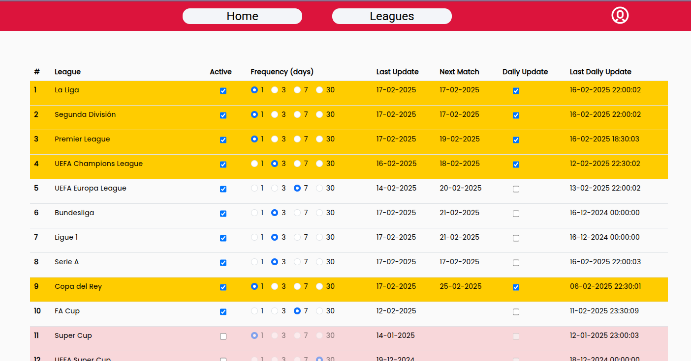

# MegaGoal

**MegaGoal** is a service within [**Mega microservices architecture**](https://github.com/MegaGera/Mega).

*MegaGoal* web application allows you to get information of football teams, save your matches and get stats about your data.

## Table of Contents

- [Service Description](#service-description)
  - [Features](#features)
- [Part of Mega](#part-of-mega)
- [Architecture](#architecture)
- [Setup and Installation](#setup-and-installation)
- [Next Features](#next-features)
- [License](#license)
- [Contact & Collaborate](#contact--collaborate)

## Service Description

*MegaGoal* offers a web application to save your historical data of viewed football matches of different competitions and then receive statistics of your favourite teams.

You can navigate through the data of more than 20 different competitions such as the Champions League, LaLiga, Premier League and more, follow live matches as its database is updated daily and then mark your favourites. You can filter the stats and see how many goals each team scored in the matches you watched. And much more is coming soon!

UI responsive design. The design is adapted to be opened with big screens and mobile screens.

The application is deployed and you can use it. Contact me with me and I will create you an account and you could use it as you want! 

This service is composed of different microservices developed with Angular, Node.js, Python, and more technologies. The [Architecture](#architecture) section provides a detailed explanation.

Web Application: [https://megagoal.megagera.com](https://megagoal.megagera.com/)

### Features

#### Viewed Matches and Stats

The user can **mark the viewed matches and visualizes a dashboard with the matches, stats and use filters** to get different insights.

In the Dashboard / Home page, the right column are the **filters** to do a search between the viewed matches, the center column are the **card matches** order by timestamp (request to *Server* service), and the left column are the **stats** (request to *Stats* service) of the teams viewed and their goals scored between the matches filtered in the search.

Desktop view:

Mobile view:

#### League Matches

The user can **navigate trhough the different leagues** and search for actual matches or from previous years.

The viewed matches are highlited with the colors of the league.

#### Team Matches and Information

The user can see the **information of a team** and their actual matches or from previous years.

#### Live Matches

The matches can be updated in the database to be live follow in the WebApp. A live match will be marked with a red flash light circle and its score will be live updated. 

  
  

#### Locations

The user can **add personal locations** where watch the matches and then assign them individually.

#### Updater and Admin

The admin users can change the periodicity of the updates of the leagues and matches with real data.

## Part of Mega

*MegaGoal* is part of the larger [**Mega**](https://github.com/MegaGera/Mega) project, a collection of web applications built with a **microservices architecture**.

[**Mega**](https://github.com/MegaGera/Mega) includes other services such as a [Proxy (*MegaProxy*)](https://github.com/MegaGera/MegaProxy), [Authentication (*MegaAuth*)](https://github.com/MegaGera/MegaAuth), and other Web Applications ([*MegaMedia*](https://github.com/MegaGera/MegaMedia), [*MegaHome*](https://github.com/MegaGera/MegaHome), [*MegaDocu*](https://docusaurus.io/))

## Architecture

There are **five services in this application**. They are all used by *MegaGoal* as a 'parent' service, but also individually by other services in *Mega*.

- **WebApp**: Web application built with [Angular v17](https://angular.io/) (TypeScript). With the application you can navigate through the different football leagues and teams and see their information and matches played for each season in different competitions. It is the entry point for the user to mark the viewed matches and visualize data. It is deployed by a Docker container. More information and source code under the [`WebApp`](WebApp) folder.
- **Server**: API Server built with `Node.js` and `Express.js` (JavaScript) to access to the entities used in the WebApp client like leagues, teams or viewed matches. It is also used by the service *MegaMedia* from outside *MegaGoal* to load the metadata of the static images of these entities. It is deployed by a Docker container. More information and source code under the [`Server`](Server) folder.
- **Stats**: API Stats server built with `Django` (Python) to generate statistics of the matches and leagues viewed by an user to be displayed in the WebApp. It is deployed by a Docker container. More information and source code under the [`Stats`](Stats) folder.
- **Database**: [`MongoDB`](https://www.mongodb.com/es) Database that stores document information of the football leagues, teams and matches. It is deployed by a Docker container in a docker-compose file.
- **Updater**: This service bilt with [`Python`](https://www.python.org/) updates the database documents adding and updating leagues, teams and matches based on a periodicity for each league assigned by admin users. This updates are done automatically by cron jobs executed in the EC2 machine where the *Mega* applications are deployed. It is deployed by a Docker container. The data is retrieved from the open API [API-FOOTBALL](https://www.api-football.com/).

All these services are deployed by [**Docker containers**](https://www.docker.com/) in a [**AWS EC2 machine**](https://aws.amazon.com/es/ec2/).

## Setup and Installation

You can run directly the `WebApp` application to have access to the user interface, but it will be empty. To have data to see in this web application, it's neccesary to run the `MongoDB` and the `API Server` applications, and execute the functions that you prefer in the `data_parser.ipynb` notebook to fill the database. For that, you will need a key to use the [API-FOOTBALL](https://www.api-football.com/), you can get access from their website or with the [rapidapi](https://rapidapi.com/api-sports/api/api-football/) provider.

The information to run `WebApp`, `Server` and `Stats` applications is under their folders of this repository. All of them are deployed with Docker and you can find the proccess of build and deploy in the `Dockerfile` and `docker-compose.yml` files of each folder.

Don't forget is everything already deployed and you can use it! It's directly available in: [https://megagoal.megagera.com](https://megagoal.megagera.com) but you will need to contact me first to create you an account.

## Next features

I will add here aaaall the ideas that I have for this application.

## License

This project is licensed under the MIT License. See the LICENSE file for details.

## Contact & Collaborate

Contact with me to collaborate :)

- gera1397@gmail.com
- GitHub: [MegaGera](https://github.com/MegaGera)