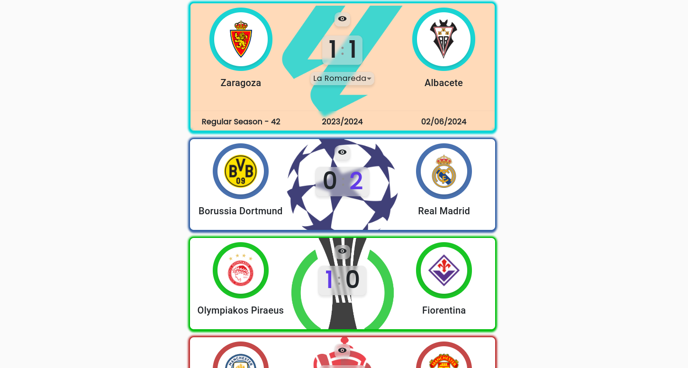
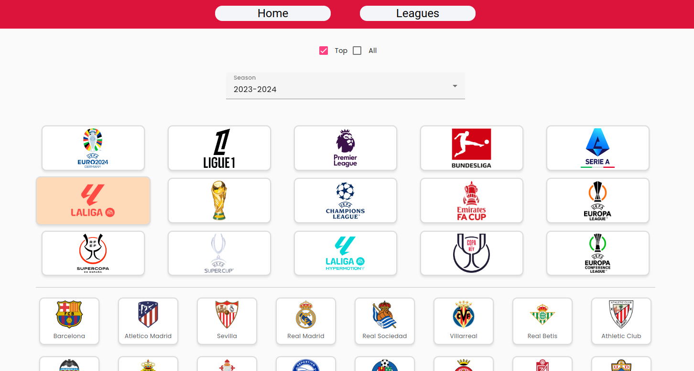
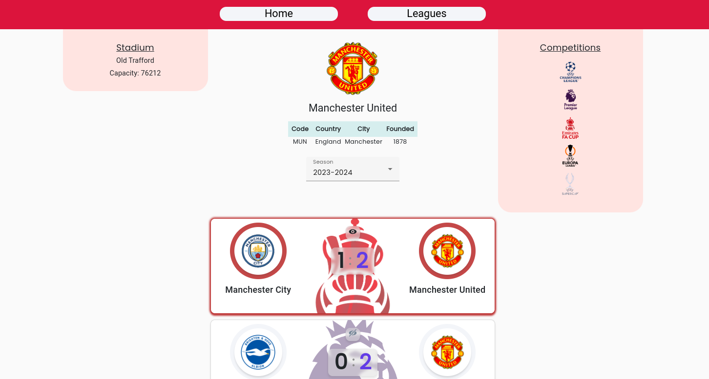
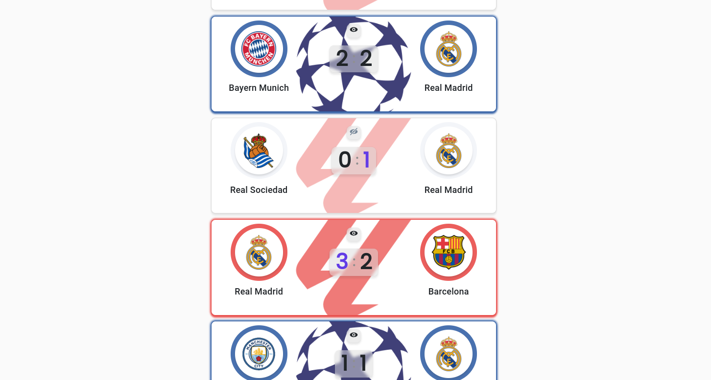

# MegaGoal - WebApp

This project was generated with [Angular CLI](https://github.com/angular/angular-cli) version 17.0.8.

## Project composition

This project contains: **Components**, **Services** and **Models**.

- **Components**:
  - The components render the view of the web application.
  - Standalone components where each one imports the neccesary modules and services.
  - App Component is the parent component of the web application.
  - With the Router Module is possible to navigate through the different components of the application.

- **Services**_
  - **Megagoal** Service provides the connection to the API where the data is stored. Is imported directly in the App Component to create just one instance of the Service and mantain the state across the components.
  - **Images** Service get the source of an image. It's only imported in the components where it's necessary.

- **Models**:
  - Validate the data models of the data retrieved from the API.

The source code is under the src folder.

## Screenshots

**Home / Favourite Football Matches**

**Leagues page**

**Team page**

## Dependencies

The dependencies and the scripts are defined in the file `package.json` and managed with [npm](https://www.npmjs.com/).

To install the dependencies run the command: `npm install`.

## Development server

Run `ng serve` for a dev server. Navigate to `http://localhost:4200/`. The application will automatically reload if detects any change of the source files.

## Code scaffolding

Run `ng generate component component-name` to generate a new component. You can also use `ng generate directive|pipe|service|class|guard|interface|enum|module`.

## Build

Run `ng build` to build the project. The build artifacts will be stored in the `dist/` directory.

## Further help

To get more help on the Angular CLI use `ng help` or go check out the [Angular CLI Overview and Command Reference](https://angular.io/cli) page.
